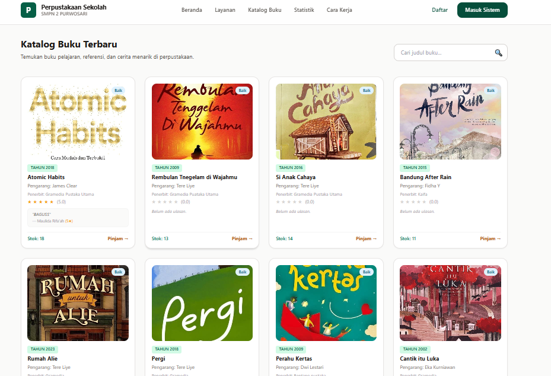
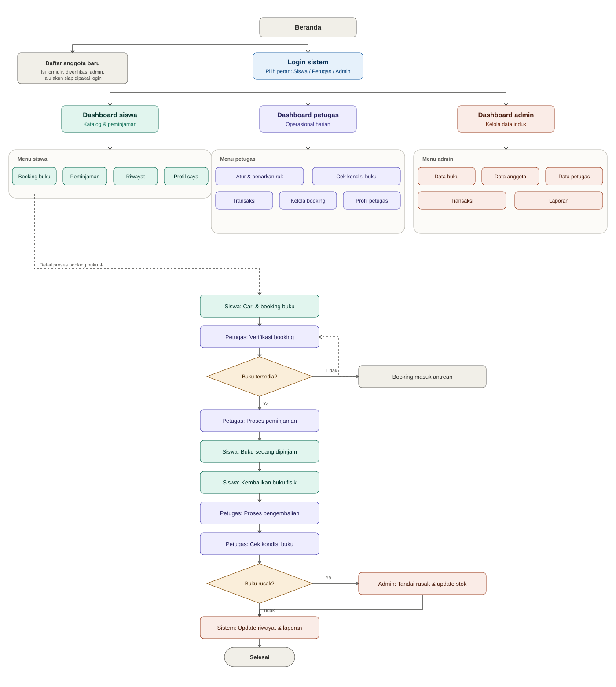
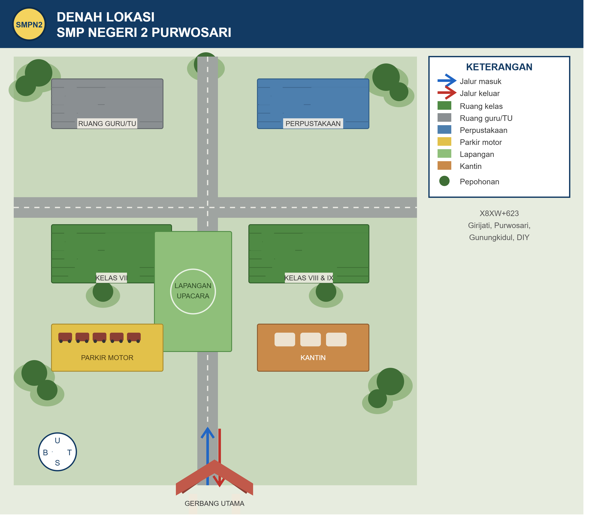

# Perpustakaan Sekolah Digital — Aplikasi Peminjaman Buku

Aplikasi web sederhana untuk mengelola peminjaman dan pengembalian buku di perpustakaan sekolah, dibangun sebagai proyek Uji Kompetensi Keahlian (UKK) SMK jurusan Rekayasa Perangkat Lunak (kode soal **KM25.4.1.1**).

Sekolah: **SMK N 1 Sanden**
Tahun pelajaran: **2025/2026**

> Aplikasi ini dirancang untuk berjalan sepenuhnya di **localhost** (tanpa koneksi internet).



## Daftar isi

- [Fitur](#fitur)
- [Peran pengguna](#peran-pengguna)
- [Teknologi](#teknologi)
- [Struktur folder](#struktur-folder)
- [Struktur database](#struktur-database)
- [Instalasi](#instalasi)
- [Alur penggunaan](#alur-penggunaan)
- [Diagram & denah](#diagram--denah)
- [Lisensi](#lisensi)

## Fitur

- Login multi-peran (admin, petugas, siswa) melalui satu halaman dengan pilihan tab
- Registrasi anggota (siswa) mandiri
- Pengelolaan data buku (CRUD) — judul, pengarang, penerbit, tahun terbit, stok, kategori, rak, cover
- Pengelolaan data anggota dan petugas (CRUD, khusus admin)
- Pengajuan peminjaman buku oleh siswa, disetujui oleh petugas/admin
- Pengajuan pengembalian buku oleh siswa, disertai rating bintang (1–5) dan ulasan
- Konfirmasi pengembalian oleh petugas/admin dengan perhitungan denda keterlambatan otomatis
- Notifikasi lonceng di dashboard admin/petugas untuk pengajuan yang menunggu diproses
- Pencarian buku (admin & siswa)
- Riwayat peminjaman per siswa
- Rata-rata rating buku dihitung otomatis dari ulasan siswa

## Peran pengguna

| Peran   | Akses |
|---------|-------|
| Admin   | Akses penuh: kelola buku, anggota, petugas, transaksi, laporan |
| Petugas | Menu terbatas: verifikasi peminjaman & pengembalian, cek kondisi buku |
| Siswa   | Cari & ajukan peminjaman buku, ajukan pengembalian, lihat riwayat, profil |

## Teknologi

- **Backend:** PHP Native
- **Database:** MySQL (dikelola lewat phpMyAdmin)
- **Server lokal:** XAMPP (Apache + MySQL)
- **Frontend:** HTML, CSS, JavaScript (native)

## Struktur folder

```
uk1/
├── admin/              # Halaman & fungsi khusus admin
├── petugas/            # Halaman & fungsi khusus petugas
├── siswa/              # Halaman & fungsi khusus siswa
├── foto_anggota/        # Foto profil anggota
├── gambar/              # Aset gambar & cover buku
├── koneksi.php          # Koneksi ke database ($conn)
├── login.php            # Halaman login (tab admin/petugas/siswa)
├── login_proses.php     # Proses autentikasi login
├── registrasi.php       # Formulir pendaftaran anggota baru
└── index1.php           # Halaman landing
```

## Struktur database

Nama database: **`perpustakaan1`**

| Tabel      | Kolom utama |
|------------|-------------|
| `admin`    | id_admin, username, password, nama_admin |
| `petugas`  | id_petugas, username, password, nama_petugas |
| `anggota`  | id_anggota, nis, nama_anggota, username, password, kelas |
| `buku`     | id_buku, kode_buku, judul_buku, pengarang, penerbit, tahun_terbit, stok, cover, kategori, rak, rating |
| `transaksi`| id_transaksi, id_buku, id_anggota, tgl_pinjam, tgl_kembali, status_transaksi, denda, rating, ulasan |

Password disimpan dalam bentuk hash `md5()`.

## Instalasi

1. Pastikan **XAMPP** sudah terpasang dan Apache + MySQL berjalan.
2. Salin folder proyek ke dalam `htdocs`, misalnya:
   ```
   C:/xampp/htdocs/uk1
   ```
3. Buka **phpMyAdmin**, buat database baru bernama `perpustakaan1`.
4. Import file `.sql` yang disertakan pada folder proyek ke database tersebut.
5. Sesuaikan konfigurasi koneksi database pada `koneksi.php` bila diperlukan (host, username, password).
6. Akses aplikasi melalui browser:
   ```
   http://localhost/uk1
   ```

## Alur penggunaan

1. Siswa login atau mendaftar akun baru.
2. Siswa mencari buku dan mengajukan peminjaman.
3. Petugas/admin memverifikasi dan menyetujui pengajuan peminjaman (stok berkurang otomatis).
4. Siswa mengajukan pengembalian beserta rating & ulasan buku.
5. Petugas/admin mengonfirmasi pengembalian; sistem menghitung denda keterlambatan (jika ada) dan mengembalikan stok buku.
6. Rating rata-rata buku diperbarui otomatis berdasarkan ulasan siswa.

## Diagram & denah

**Flowchart alur sistem** (navigasi, login, hingga proses peminjaman-pengembalian buku):



**Denah lokasi sekolah:**



Dokumen penjelasan algoritma lengkap tersedia di [`Algoritma_Aplikasi_Peminjaman_Buku.docx`](Algoritma_Aplikasi_Peminjaman_Buku.docx).

## Lisensi

Proyek ini dibuat untuk keperluan Uji Kompetensi Keahlian (UKK) dan bersifat open untuk pembelajaran.
